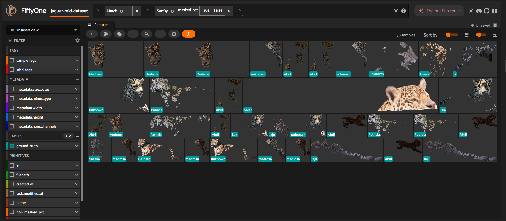
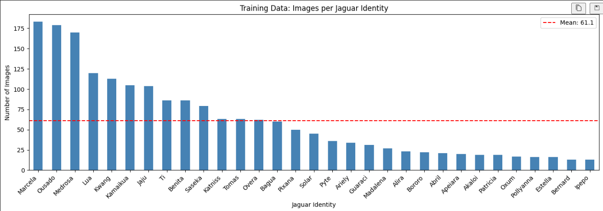
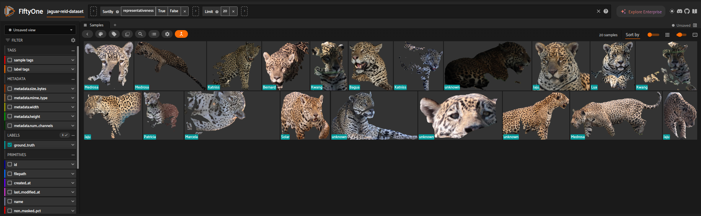
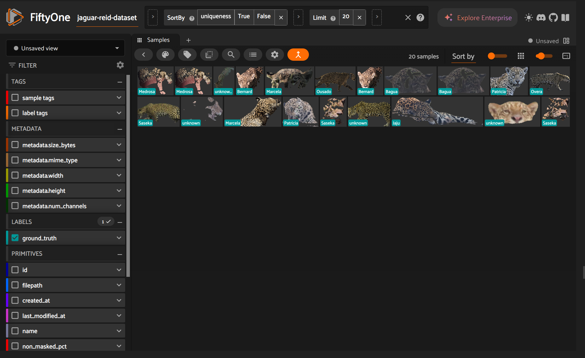
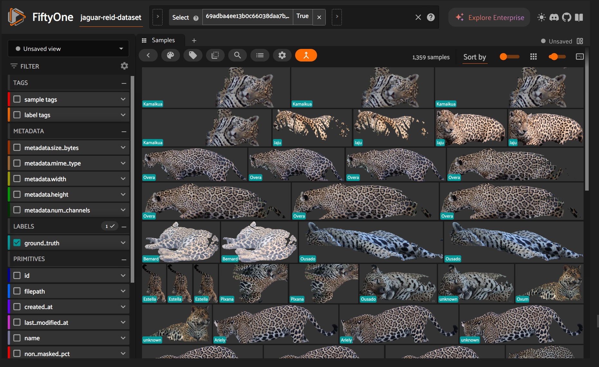

# Exploratory Data Analysis Experiments

This document summarizes exploratory data analysis experiments conducted to better understand the dataset and analyze the behavior of embedding models used for jaguar re-identification.

The goals of these experiments were:

- to identify structural properties of the dataset
- to detect potential issues such as class imbalance or duplicate images
- to analyze embedding representations
- to investigate whether models rely on background information

All experiments were conducted before or alongside model training to guide subsequent modeling decisions.

Implementation details and visualizations can be found in the corresponding [notebooks](https://github.com/CarloColumbo/Kaggle-Competition-Jaguar-Re-identification).

## Exploratory Data Analysis Notebook

In [00_exploratory_data_analysis](notebooks/00_exploratory_data_analysis.ipynb), we explored and familiarized ourselves with the dataset. We used [FiftyOne](https://docs.voxel51.com/) to visualize samples and analyze specific dataset characteristics.

We focused on the following questions
1. **Image Quality**  
   What are the resolution characteristics and foreground-background ratios of the images?

2. **Identity Distribution**  
   How balanced is the distribution of images across jaguar identities?

3. **Duplicate Images**  
   Does the dataset contain duplicate or near-duplicate images that could bias training?

4. **Embedding Structure**  
   Do image embeddings cluster according to jaguar identity?

We created a [Wandb Run](https://wandb.ai/karl-schuetz-hasso-plattner-institut/jaguar-reid-karl-matti-schuetz/runs/9mbyr0ms) even that no model training was involved.

### Image Quality Analysis

In camera trap datasets, a large portion of the image may consist of background vegetation or terrain. If the foreground object occupies only a small region, models may struggle to learn discriminative features.

We analyzed:

- image width and height distributions
- proportion of masked pixels representing background

Initial inspection revealed that in many images the jaguar occupies only a relatively small portion of the frame, while the majority of pixels correspond to background.

This observation raises the concern that models may learn background-specific cues, such as vegetation or camera location, rather than focusing exclusively on the jaguar’s coat pattern.

Example images with high background ratios are shown below.

### Identity Distribution

Re-identification datasets often exhibit a **long-tailed distribution** of identities, where some individuals are represented by many images while others appear only rarely. This imbalance can bias training toward frequently observed identities.

We analyzed the number of images per identity and visualized the distribution:

The dataset shows a clear class imbalance:

- a small number of identities account for a large fraction of the images
- several identities appear only in a limited number of samples

Such imbalance can reduce model performance for underrepresented individuals.

This observation motivated later experiments with **class balancing strategies during training**.

### Embedding Analysis

We generated embeddings for all images using the **MegaDescriptor** model.

Using these embeddings, we performed:

- identification of representative images
- identification of unique images

**Representative Images** - Images located near the center of clusters

We can see that the representative images cover a variety of different individuals. However, some individuals are missing, while others appear multiple times. For example, Medrosa has three images that are considered highly representative. Some test images also appear to be representative of the dataset. These images mostly consist of high-quality samples where the jaguar is clearly visible and its coat patterns can be easily observed.

**Unique Images** - Images located far from other samples in embedding space.  

These may contain:

- unusual viewpoints
- occlusions
- partial visibility of the animal
- special postures

These images may be harder for models to correctly classify.

### Duplicate Analysis

Camera trap datasets frequently contain burst sequences or slightly shifted frames that are nearly identical. If such duplicates appear in both training and validation sets, evaluation results may be overly optimistic.

We performed near-duplicate detection using similarity search in the embedding space produced by the MegaDescriptor model. Images with very high embedding similarity were flagged as potential duplicates. 

The analysis identified **1,359 near-duplicate images**.

These duplicates typically correspond to:

- sequential frames captured by the same camera
- small positional changes of the animal within the frame

While duplicates may not always harm training, they reduce the effective diversity of the dataset.

Future work could investigate **duplicate removal or filtering strategies**.

Example duplicates are shown below.

## Background Interventions

From the image quality analysis, we observed that a large fraction of pixels correspond to background. This raises the question:

**Does the embedding model rely on background information to distinguish individuals?**

To investigate this, we performed a set of controlled background interventions within [01_background_intervention](notebooks/01_background_interventions.ipynb).

We tested the following background interventions:

1. **Baseline:** Unmodified images.
2. **Constant Background:** All masked pixels are filled with a constant value.
3. **Noise Background:** All masked pixels are filled with random values.
4. **Extended Foreground Edges:** Background is removed, and the empty space is filled by extending the foreground.
5. **Foreground Sampling for Background Filling:** Background pixels are filled by randomly sampling non-masked regions of the same image.
6. **Constant Image Background:** A single fixed image is used as the background for all images.
7. **Blurred Background:** A Gaussian blur is applied only to the background pixels.

### Results

Experiments were performed using multiple random seeds.

| Intervention           | Seed 36      | Seed 34      | Seed 78      | Seed 9       | Seed 12      | Mean mAP     | Std (mAP)    | Mean Epoch | Avg Position |
| ---------------------- | ------------ | ------------ | ------------ | ------------ | ------------ | ------------ | ------------ | ---------- | ------------ |
| Baseline               | **0.810537** | 0.770037     | **0.775120** | 0.822747     | 0.795316     | 0.794751     | 0.022603     | 80.40      | 2.20         |
| Constant Background    | 0.754350     | 0.798946     | 0.740401     | 0.793912     | 0.768489     | 0.771220     | 0.024018     | 84.40      | 4.00         |
| Noise Background       | 0.760136     | 0.775250     | 0.757010     | 0.799823     | 0.750507     | 0.768545     | 0.019577     | 90.60      | 4.40         |
| Extend Foreground      | 0.798990     | 0.765949     | 0.756068     | 0.812497     | 0.749464     | 0.776594     | 0.027231     | 68.60      | 3.80         |
| Sampling Foreground    | 0.776228     | 0.762772     | 0.753942     | 0.808110     | 0.767584     | 0.773727     | 0.021310     | 83.60      | 4.40         |
| Const Background Image | 0.761393     | 0.772697     | 0.766144     | 0.796175     | 0.771862     | 0.773654     | 0.013239     | 75.40      | 4.00         |
| Blur Background        | 0.793350     | **0.804884** | 0.770682     | **0.834982** | **0.813057** | **0.803391** | 0.023788     | 87.00      | **1.20**     |

### Interpretation

Our findings suggest that the background is an important feature for the embedding model. Completely removing it, for example by replacing it with a constant color, drastically reduced the identity-balanced mAP on the validation set. Most interventions that strongly disturbed the background (noise, foreground sampling, constant background image, or extending the foreground) were unable to reach the baseline mAP.

The final intervention, where the background was blurred, slightly improved the mAP. This indicates that the background still contains useful information for distinguishing jaguars, suggesting that the model does not rely exclusively on coat patterns and may struggle to fully generalize across environments. Based on these results, we decided to use the **blurred background** version of the dataset for all subsequent experiments.

The public leaderboard score of **0.7** suggests that the intervention may have worsened the model. However, this result was obtained from a single seed, while the validation mAP across multiple seeds indicates that using blurred backgrounds is still a reasonable choice.

### Wandb runs
- Seed 36: https://wandb.ai/karl-schuetz-hasso-plattner-institut/jaguar-reid-karl-matti-schuetz/runs/kl1e2tix?nw=nwuserkarlschuetz
- Seed 34: https://wandb.ai/karl-schuetz-hasso-plattner-institut/jaguar-reid-karl-matti-schuetz/runs/gby3xk1d?nw=nwuserkarlschuetz
- Seed 78: https://wandb.ai/karl-schuetz-hasso-plattner-institut/jaguar-reid-karl-matti-schuetz/runs/dhv2xmbo?nw=nwuserkarlschuetz
- Seed  9: https://wandb.ai/karl-schuetz-hasso-plattner-institut/jaguar-reid-karl-matti-schuetz/runs/hfwowpvm?nw=nwuserkarlschuetz
- Seed 12: https://wandb.ai/karl-schuetz-hasso-plattner-institut/jaguar-reid-karl-matti-schuetz/runs/kl1e2tix?nw=nwuserkarlschuetz

## Class Balance Intervention

From our observation that the identity distribution is heavy-tailed, we inferred that the model likely performs worse on underrepresented identities because they appear less frequently in the training data. To address this issue, we conducted an experiment in [07_class_balance](notebooks/07_class_balance.ipynb) where we evaluated several interventions and their influence on the identity-based mAP on the validation set:

1. **Baseline**
2. **Weighted Sampling**
3. **Generate Augmented Samples**
4. **Weighted Sampling + Augmentation**

For **Weighted Sampling** and **Weighted Sampling + Augmentation**, we used a sampler that assigns higher weights to underrepresented identities. For **Generated Augmented Samples** and **Weighted Sampling + Augmentation**, we added augmented versions of samples to increase dataset diversity. All interventions used the same training pipeline, with the only difference being the data loading strategy. The experiment used the setup and results previously established in Experiments 00-06.

### Results
| Strategy                         | Seed 2      | Seed 35      | Seed 78      | Mean mAP | Std (mAP) | Mean Epoch | Mean Training Time | Avg Position |
| --------------------------------- | ----------- | ------------ | ------------ | -------- | --------- | ---------- | ------------------ | ------------ |
| Baseline                          | 0.835335    | 0.873481     | 0.881857     | 0.863558 | 0.024798  | 91.7       | 147.083            | 3.3          |
| Weighted Sampling                 | 0.83809     | 0.876663     | **0.889613** | 0.868122 | 0.026802  | 64.3       | 114.326            | 2.3          |
| Generated Augmentations           | **0.85299** | **0.887964** | 0.87382      | **0.871591** | **0.017593**  | 49.3       | **100.050**        | **1.7**      |
| Weighted Sampling + Augmentations | 0.847306    | 0.881851     | 0.828407     | 0.852521 | 0.027101  | 60.0       | 2393.55            | 3.7          |

The interventions led only to small improvements in mAP. This suggests that the dataset may already be sufficiently diverse. However, a slight statistical improvement can still be observed.

It is noteworthy that the difference between **Weighted Sampling** and **Generated Augmentations** is very small. Earlier analysis showed that many samples in the dataset are near-duplicates with only minor variations. This indicates that the dataset does not benefit from heavy augmentations but rather from small variations that help balance the distribution of images per identity.

Based on these results, we proceeded with **Generated Augmentations** in subsequent experiments. Although this approach slightly improved mAP, it significantly increased execution time because embeddings had to be recomputed for every notebook run.

The public submission score also indicates that **Generated Augmentations** are promising, achieving a score of 0.841.

### Wandb runs
- Seed 2: https://wandb.ai/karl-schuetz-hasso-plattner-institut/jaguar-reid-karl-matti-schuetz/runs/qjyl72kt?nw=nwuserkarlschuetz
- Seed 35: https://wandb.ai/karl-schuetz-hasso-plattner-institut/jaguar-reid-karl-matti-schuetz/runs/2peqzcdb?nw=nwuserkarlschuetz
- Seed 78: https://wandb.ai/karl-schuetz-hasso-plattner-institut/jaguar-reid-karl-matti-schuetz/runs/kczr92ii?nw=nwuserkarlschuetz

# Key Findings

The exploratory analysis revealed several important properties of the dataset:

1. **Large background regions** are present in many images.
2. **Identity distribution is highly imbalanced** and balancing intervention can help improving the mAP.
3. **Near-duplicate images are common.**
4. **Background information influences embedding quality.**

These insights guided later modeling decisions, including preprocessing choices and training strategies.