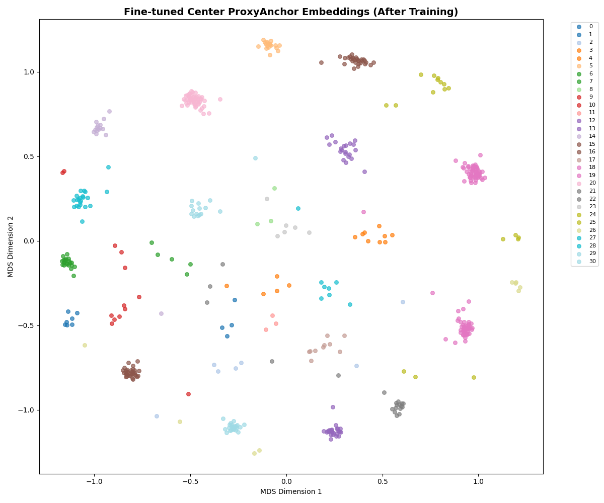
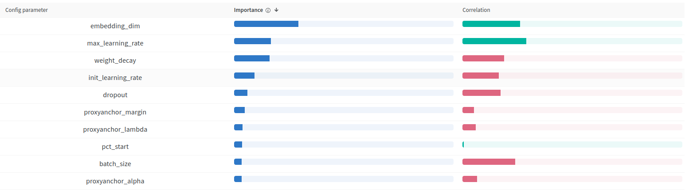

# Leaderboard Experiments

This document summarizes the leaderboard experiments conducted to identify a model architecture and training pipeline that maximize performance on the jaguar re-identification task.

In each experiment, we focus on improving the identity-balanced mAP on the validation set. To isolate the effect of individual components, we keep the training pipeline and model configuration fixed and modify only a single component per experiment whenever possible.

For every run, we logged the generated submission file. Additionally, on the competition page on [Kaggle](https://www.kaggle.com/competitions/jaguar-re-id), we documented the origin of each submission in the description to maintain traceability between leaderboard results and experiment configurations.

The experiments focused on the following aspects:

1. **Backbone** selection ([02_backbone](notebooks/02_backbone.ipynb)):
    Which backbone architecture provides the best trade-off between predictive performance on the jaguar ReID task and computational efficiency?

2. **Loss function** selection ([03_loss](notebooks/03_loss.ipynb)):
    Which loss function achieves the best performance in terms of identity-balanced mAP? What characteristics should a suitable loss function have for this task?

3. **Combination of loss functions** ([04_loss_combined](notebooks/04_loss_combined.ipynb)):
    Does combining two different loss functions improve model training compared to using a single loss function? How does this affect predictive performance and training efficiency?

4. **Optimizer** selection ([05_optimizers](notebooks/05_optimizers.ipynb)):
    Which optimizer enables the most stable and smooth training process?

5. Learning rate **scheduler** [06_scheduler](notebooks/06_scheduler.ipynb):
    Which scheduler improves training speed while maintaining stable gradients and reducing training noise?

6. **Hyperparameter sweep** ([08a_sweep](notebooks/08a_sweep.ipynb), [08b_sweep](notebooks/08b_sweep.ipynb)):
    Which hyperparameters work best for the model design, and how sensitive are the results to different random seeds?

7. **Reranking** of final results ([09_reranking](notebooks/09_reranking.ipynb)):
    Can identity-balanced mAP be improved by applying reranking to the final cosine similarity distances?
    
The experiments were conducted sequentially in the order listed above. After each experiment, we selected the best-performing component and used it in subsequent experiments. This incremental approach allowed us to progressively improve the model configuration. However, a limitation of this strategy is that suboptimal early decisions may negatively affect later experiments.

Implementation details and visualizations are available in the corresponding [notebooks](https://github.com/CarloColumbo/Kaggle-Competition-Jaguar-Re-identification).

## 1. Backbone Comparison

In this project, we focus exclusively on training embedding projection models. In this setup, the most important component is the backbone model, which generates the initial image embeddings. These embeddings are then refined by the projection model.

For effective re-identification, the backbone must produce highly descriptive and discriminative embeddings that capture identity-specific visual features.

We compared the following backbone models in [02_backbone](notebooks/02_backbone.ipynb):

1. **MegaDescriptor**
2. **CLIP**
3. **DINOv3**
4. **EfficientNet**
5. **ResNet18**

Each backbone was used to embed all images in the dataset. For each backbone, we then trained a projection model on the generated embeddings. The training setup was kept identical across experiments, except for the input embedding dimension, which depends on the backbone.

### Results
| Backbone       | Seed 4       | Seed 7       | Seed 90      | Seed 856     | Seed 21      | Mean mAP     | Std (mAP) | Mean Epoch | Mean Embedding Time | Mean Training Time | Avg Position |
| -------------- | ------------ | ------------ | ------------ | ------------ | ------------ | ------------ | --------- | ---------- | ------------------- | ------------------ | ------------ |
| MegaDescriptor | 0.845019     | 0.814579     | 0.784838     | 0.765074     | 0.733252     | 0.788552     | 0.043269  | 90.0       | 135.0               | 172.467            | 2.2          |
| CLIP           | 0.802713     | 0.794566     | 0.776417     | 0.735205     | 0.690422     | 0.759465     | 0.046756  | 130.6      | 90.8                | 234.356            | 3.6          |
| Dino           | **0.870783** | **0.845053** | **0.829684** | **0.812577** | **0.780221** | **0.827664** | 0.034074  | 83.4       | 104.7               | 174.314            | **1.0**      |
| EfficientNet   | 0.830311     | 0.762886     | 0.773556     | 0.780844     | 0.720779     | 0.773675     | 0.039286  | 90.6       | 141.1               | 196.480            | 3.4          |
| ResNet18       | 0.650435     | 0.664405     | 0.663641     | 0.626006     | 0.598869     | 0.640671     | 0.028057  | 90.2       | 136.4               | 187.938            | 5.0          |

The **DINOv3** backbone clearly outperforms the other evaluated models. It achieves the highest mean mAP across all seeds, while also showing lower variance compared to most alternatives. Additionally, the model converges slightly faster than several other backbones.

Using **DINOv3** also improved the public leaderboard score to 0.751, confirming that the performance gains generalize beyond the validation set.

Based on these results, **DINOv3** was selected as the backbone for all subsequent experiments.

### Wandb runs:
- Seed   4: https://wandb.ai/karl-schuetz-hasso-plattner-institut/jaguar-reid-karl-matti-schuetz/runs/jb256kh5?nw=nwuserkarlschuetz
- Seed   7: https://wandb.ai/karl-schuetz-hasso-plattner-institut/jaguar-reid-karl-matti-schuetz/runs/xd11wr8o?nw=nwuserkarlschuetz
- Seed  90: https://wandb.ai/karl-schuetz-hasso-plattner-institut/jaguar-reid-karl-matti-schuetz/runs/m9xn33hd?nw=nwuserkarlschuetz
- Seed 856: https://wandb.ai/karl-schuetz-hasso-plattner-institut/jaguar-reid-karl-matti-schuetz/runs/mr3mohwf?nw=nwuserkarlschuetz
- Seed  21: https://wandb.ai/karl-schuetz-hasso-plattner-institut/jaguar-reid-karl-matti-schuetz/runs/ppjzs2xy?nw=nwuserkarlschuetz

## 2. Loss Comparision

After identifying a strong backbone for our use case, the next step is selecting an appropriate loss function for training the embedding projection model. The loss function has a significant impact on both the retrieval performance (mAP) and the stability of training.

Furthermore, the best-performing loss function can provide insight into which properties are most important for structuring the embedding space. For example, some loss functions such as **ArcFace Loss** increase the angular margin between identities, while others such as **Center Loss** explicitly reduce intra-class variance by learning class centers in the embedding space.

The following loss functions were evaluated in [03_loss](notebooks/03_loss.ipynb):

1. **ArcFace Loss**
2. **CosFace Loss**
3. **SphereFace Loss**
4. **Proxy Anchor Loss**
5. **Sub-Center ArcFace Loss**
6. **Center Loss**
7. **Batch-Hard Triplet Loss**

### Results

| Loss Function        | Seed 42      | Seed 66      | Seed 102     | Seed 305     | Seed 12      | Mean mAP     | Std (mAP)    | Mean Epoch | Mean Time  | Avg Position |
| -------------------- | ------------ | ------------ | ------------ | ------------ | ------------ | ------------ | ------------ | ---------- | ---------- | ------------ |
| ArcFaceLoss          | 0.810142     | 0.809076     | 0.793583     | 0.813424     | 0.845993     | 0.814444     | 0.019228     | 77.60      | 101.80     | 3.80         |
| CosFaceLoss          | 0.807405     | 0.813197     | 0.788920     | 0.800354     | 0.838721     | 0.809719     | 0.018567     | **73.40**  | **100.54** | 4.20         |
| SphereFaceLoss       | 0.831131     | **0.860190** | 0.812642     | 0.752520     | 0.863378     | 0.823972     | 0.045138     | 127.00     | 174.73     | 3.20         |
| ProxyAnchorLoss      | 0.829121     | 0.858875     | **0.839110** | 0.816946     | 0.854525     | 0.839715     | 0.017446     | 128.60     | 178.72     | 2.40         |
| SubCenterArcFaceLoss | 0.667916     | 0.700064     | 0.721361     | 0.699483     | 0.707221     | 0.699209     | 0.019589     | 105.60     | 159.25     | 7.00         |
| Center Loss          | **0.842462** | 0.849450     | 0.828360     | **0.847258** | **0.867817** | **0.847069** | **0.014208** | 165.40     | 231.33     | **1.40**     |
| Batch Hard Triplet   | 0.765055     | 0.732546     | 0.769427     | 0.758815     | 0.780067     | 0.761182     | 0.017785     | 101.00     | 160.86     | 6.00         |

**Center Loss** achieves the highest mean mAP across all evaluated loss functions while also exhibiting the lowest variance across seeds, indicating stable training behavior.

This suggests that explicitly minimizing intra-class variance is particularly beneficial for this re-identification task. By learning class centers in the embedding space, **Center Loss** encourages embeddings of the same identity to cluster tightly around their corresponding center.

Using **Center Loss** also improved the public leaderboard score to 0.786, confirming that the improvement generalizes beyond the validation set.

### Wandb runs:
- Seed 42: https://wandb.ai/karl-schuetz-hasso-plattner-institut/jaguar-reid-karl-matti-schuetz/runs/4emyw0ox?nw=nwuserkarlschuetz
- Seed 66: https://wandb.ai/karl-schuetz-hasso-plattner-institut/jaguar-reid-karl-matti-schuetz/runs/7p827dmg?nw=nwuserkarlschuetz
- Seed 102: https://wandb.ai/karl-schuetz-hasso-plattner-institut/jaguar-reid-karl-matti-schuetz/runs/uwbc18ao?nw=nwuserkarlschuetz
- Seed 305: https://wandb.ai/karl-schuetz-hasso-plattner-institut/jaguar-reid-karl-matti-schuetz/runs/e4va5g2w?nw=nwuserkarlschuetz
- Seed 12: https://wandb.ai/karl-schuetz-hasso-plattner-institut/jaguar-reid-karl-matti-schuetz/runs/30txt1y1?nw=nwuserkarlschuetz

## 3. Loss Combinations

In the previous experiment, **Center Loss** and **Proxy Anchor Loss** showed promising performance for the jaguar re-identification task. A natural extension is to combine both loss functions, potentially leveraging their complementary properties.

The intuition behind this approach is that different loss functions encourage different structures in the embedding space. **Center Loss** reduces intra-class variance by encouraging embeddings of the same identity to cluster around a learned class center. In contrast, **Proxy Anchor Loss** promotes inter-class separation by optimizing distances between embeddings and proxy representations of each class.

By combining these two objectives, the model may benefit from both compact identity clusters and improved class separation. This approach was evaluated in [04_loss_combined](notebooks/04_loss_combined.ipynb).

### Results
| Loss Function                   | Seed 3       | Seed 908     | Seed 45      | Seed 33      | Seed 123     | Mean mAP     | Std (mAP) | Mean Epoch | Mean Time   | Avg Position |
| ------------------------------- | ------------ | ------------ | ------------ | ------------ | ------------ | ------------ | --------- | ---------- | ----------- | ------------ |
| Center Loss                     | 0.923984     | **0.928725** | 0.862973     | **0.880770** | 0.870704     | 0.893431     | 0.030756  | 159.6      | **220**     | 2            |
| Combined (Center + ProxyAnchor) | 0.926113     | 0.926888     | **0.867175** | 0.877847     | **0.891981** | **0.898001** | **0.027465**  | 169.8      | 268         | **1.8**  |
| Combined (Center + ArcFace)     | **0.930783** | 0.925359     | 0.843008     | 0.879712     | 0.880382     | 0.891849     | 0.036411  | 173.4      | 300         | 2.2          |

The combined loss **Center Loss + Proxy Anchor Loss** slightly outperforms the baseline **Center Loss** in terms of mean mAP while also achieving a lower variance across seeds. This indicates that combining intra-class compactness with proxy-based inter-class separation improves the structure of the learned embedding space.

Although the improvement is modest, the combined loss achieves the best overall ranking across experiments and was therefore selected for subsequent experiments.

Using this loss combination increased the public leaderboard score to 0.806.

The MDS visualization below illustrates how the embeddings cluster more tightly by identity when using the combined loss.

### Wandb runs
- Seed 3: https://wandb.ai/karl-schuetz-hasso-plattner-institut/jaguar-reid-karl-matti-schuetz/runs/md9bvsih?nw=nwuserkarlschuetz
- Seed 908: https://wandb.ai/karl-schuetz-hasso-plattner-institut/jaguar-reid-karl-matti-schuetz/runs/zo0usamg?nw=nwuserkarlschuetz
- Seed 45: https://wandb.ai/karl-schuetz-hasso-plattner-institut/jaguar-reid-karl-matti-schuetz/runs/8u5evx5v?nw=nwuserkarlschuetz
- Seed 33: https://wandb.ai/karl-schuetz-hasso-plattner-institut/jaguar-reid-karl-matti-schuetz/runs/insejndd?nw=nwuserkarlschuetz
- Seed 123: https://wandb.ai/karl-schuetz-hasso-plattner-institut/jaguar-reid-karl-matti-schuetz/runs/hxbq8syi?nw=nwuserkarlschuetz

## 4. Optimizer Comparison

After selecting a suitable backbone and loss function, we investigated whether training stability and performance could be improved by using different optimizers. These experiments were conducted in [05_optimizers](notebooks/05_optimizers.ipynb).

The following optimizers were evaluated under the same training pipeline:

1. **Adam**
2. **AdamW**
3. **NAdam**
4. **SGD + Momentum**
5. **RMSProp**

### Results
| Optimizer | Seed 12    | Seed 67      | Seed 99      | Seed 87      | Seed 334     | Mean mAP     | Std (mAP) | Mean Epoch | Mean Training Time | Avg Position |
| --------- | ---------- | --------     | ------------ | ------------ | ------------ | --------     | --------- | ---------- | ------------------ | ------------ |
| Adam      | 0.884543   | **0.850196** | 0.871263     | 0.907684     | 0.838015     | 0.870340     | 0.027604  | 41.2       | 72.729             | 2.0          |
| AdamW     | **0.9008** | 0.846063     | **0.879358** | 0.901981     | **0.838438** | **0.873328** | 0.029886  | 46.2       | 83.259             | 1.6          |
| NAdam     | 0.896485   | 0.841654     | 0.864915     | **0.907889** | 0.835509     | 0.869290     | 0.032224  | 40.6       | 67.955             | 2.5          |
| SGD       | 0.833591   | 0.777868     | 0.818324     | 0.855106     | 0.794424     | 0.815863     | 0.030674  | 16.2       | 37.668             | 4.0          |
| RMSprop   | 0.745348   | 0.663232     | 0.707518     | 0.718692     | 0.650438     | 0.697046     | 0.039456  | 9.4        | **30.569**         | 5.0          |

**AdamW** achieves the highest mean mAP among the evaluated optimizers, although the performance differences compared to **Adam** and **NAdam** are relatively small.

Since **AdamW** was already used in earlier experiments, the optimizer choice in the training pipeline remains unchanged.

Using the best-performing optimizer configuration also improved the public leaderboard score to 0.819.

### Wandb runs
- Seed 12: https://wandb.ai/karl-schuetz-hasso-plattner-institut/jaguar-reid-karl-matti-schuetz/runs/e6q5frhl?nw=nwuserkarlschuetz
- Seed 67: https://wandb.ai/karl-schuetz-hasso-plattner-institut/jaguar-reid-karl-matti-schuetz/runs/0lav3zhj?nw=nwuserkarlschuetz
- Seed 99: https://wandb.ai/karl-schuetz-hasso-plattner-institut/jaguar-reid-karl-matti-schuetz/runs/1m3r15pp?nw=nwuserkarlschuetz
- Seed 87: https://wandb.ai/karl-schuetz-hasso-plattner-institut/jaguar-reid-karl-matti-schuetz/runs/9a363p43?nw=nwuserkarlschuetz
- Seed 334: https://wandb.ai/karl-schuetz-hasso-plattner-institut/jaguar-reid-karl-matti-schuetz/runs/80bbzm3p?nw=nwuserkarlschuetz

## 5. Scheduler Comparison

The final component of the training pipeline is the learning rate scheduler. Different schedulers can influence training stability, convergence speed, and final model performance. We compared several scheduler strategies in [06_scheduler](notebooks/06_scheduler.ipynb). The training function was extended to support multiple scheduler types.

The following schedulers were evaluated:

1. **StepLR**
2. **CosineAnnealingLR**
3. **ReduceLROnPlateau**
4. **ExponentialLR**
5. **OneCycleLR**

### Results
| Scheduler         | Seed 34      | Seed 46  | Seed 78      | Seed 98      | Seed 234     | Mean mAP     | Std (mAP)     | Mean Epoch | Mean Training Time | Avg Position |
| ----------------- | ------------ | -------- | ------------ | ------------ | ------------ | ------------ | ---------     | ---------- | ------------------ | ------------ |
| StepLR            | 0.840217     | 0.846933 | 0.821254     | 0.831274     | 0.863379     | 0.840611     | 0.015972      | 23.6       | **46.132**         | 4.6          |
| CosineAnnealingLR | **0.857931** | **0.875787** | 0.853690     | 0.859898     | 0.890453     | 0.867552     | 0.015294      | 20.4       | 44.992             | 1.8          |
| ReduceLROnPlateau | 0.838675     | 0.858497 | 0.851659     | 0.867299     | 0.888780     | 0.860982     | 0.018731      | 184.2      | 269.648            | 3.4          |
| ExponentialLR     | 0.847357     | 0.865327 | 0.819214     | 0.850021     | 0.873608     | 0.851105     | 0.020862      | 25.8       | 55.050             | 3.8          |
| OneCycleLR        | 0.852396     | 0.868097 | **0.875455** | **0.875737** | **0.894362** | **0.873209** | **0.015151**  | 69.6       | 131.160            | **1.4**      |

**OneCycleLR** achieves the highest mean mAP among the evaluated schedulers and also exhibits the lowest variance across seeds. Although the training time is longer compared to simpler schedulers such as **StepLR** or **CosineAnnealingLR**, the improved retrieval performance makes it the preferred choice for this task.

The **CosineAnnealingLR** scheduler performs similarly but yields slightly lower mean mAP. Simpler decay strategies such as **StepLR** and **ExponentialLR** perform noticeably worse.

Based on these results, **OneCycleLR** was selected as the scheduler for the final training pipeline.

Using this scheduler increased the public leaderboard score further to 0.827.

### Wandb runs
- Seed 34: https://wandb.ai/karl-schuetz-hasso-plattner-institut/jaguar-reid-karl-matti-schuetz/runs/unkyt26r?nw=nwuserkarlschuetz
- Seed 46: https://wandb.ai/karl-schuetz-hasso-plattner-institut/jaguar-reid-karl-matti-schuetz/runs/o5z6vfhu?nw=nwuserkarlschuetz
- Seed 78: https://wandb.ai/karl-schuetz-hasso-plattner-institut/jaguar-reid-karl-matti-schuetz/runs/r8tfbx2l?nw=nwuserkarlschuetz
- Seed 98: https://wandb.ai/karl-schuetz-hasso-plattner-institut/jaguar-reid-karl-matti-schuetz/runs/8tu4sty8?nw=nwuserkarlschuetz
- Seed 234: https://wandb.ai/karl-schuetz-hasso-plattner-institut/jaguar-reid-karl-matti-schuetz/runs/qswnnsjg?nw=nwuserkarlschuetz

## 6. Hyperparameter Sweep

Up to this point, hyperparameters were either taken from the [baseline notebook](notebooks/jaguar-re-identification-challenge-baseline.ipynb) or selected based on intuition and small preliminary runs.

To optimize the model systematically, we performed a hyperparameter sweep using [08a_sweep](notebooks/08a_sweep.ipynb) and [08b_sweep](notebooks/08b_sweep.ipynb). The experiment was divided into two parts:

- Exploration sweep – multiple hyperparameter configurations were evaluated using the WandB sweep agent.
- Validation sweep – the top-performing configurations were retrained across multiple seeds to assess statistical significance and variability.

### Sweep Methodology

- Search strategy: Bayesian optimization, chosen due to the large search space. Grid search was not feasible given the combinatorial explosion of hyperparameter options.
- Training procedure: Each configuration was trained with the same pipeline as previous experiments.
- Sweep configuration: Detailed in [sweep configuration](sweep.yaml)
- Hyperparameters included: learning rate, embedding and hidden dimension, weight decay, batch size, and more.

The best model from the sweep achieved a public submission score of 0.826 during the exploration phase.

### Results

| Run ID   | Seed 57      | Seed 90      | Seed 876     | Seed 23     | Seed 4      | Mean mAP     | Std (mAP) | Mean Epoch | Mean Training Time | Avg Position |
| -------- | ------------ | ------------ | ------------ | ----------- | ----------- | ------------ | --------- | ---------- | ------------------ | ------------ |
| baseline | 0.836098     | 0.851829     | **0.879425** | **0.88522** | 0.898983    | 0.870311     | 0.025688  | 70.0       | 117.593            | 2.4          |
| ferxn83y | **0.858864** | 0.872562     | 0.875528     | 0.873023    | 0.899549    | 0.875905     | **0.014740**  | 42.6       | 82.082             | 2.0          |
| nnoo062x | 0.858243     | **0.877326** | 0.869504     | 0.873871    | **0.92511** | **0.880811** | 0.025787  | 28.0       | **61.192**         | **1.8**      |
| yzhfspuz | 0.830943     | 0.858892     | 0.859187     | 0.855243    | 0.884433    | 0.857740     | 0.018975  | 33.2       | 69.493             | 3.8          |

While `ferxn83y` was the best run in the sweep overall, `nnoo062x` achieved a higher mean mAP across the evaluated seeds. Therefore, the configuration from `nnoo062x` was selected for the final experiment.

The feature importance analysis (Figure below) indicates that larger embedding dimensions and higher learning rates have the most significant impact on model performance.

The best model from the hyperparameter sweep achieved a public score of 0.853 and a private score of 0.872, representing the highest performance across all experiments and confirming the effectiveness of the hyperparameter optimization process.

### Wandb Sweeps
- Sweep with 60 runs: https://wandb.ai/karl-schuetz-hasso-plattner-institut/jaguar-reid-karl-matti-schuetz/sweeps/hwjzuewa
- Final Sweep with 100 runs: https://wandb.ai/karl-schuetz-hasso-plattner-institut/jaguar-reid-karl-matti-schuetz/sweeps/jeuoccta

### Wandb runs for significance analysis
- Seed 57: https://wandb.ai/karl-schuetz-hasso-plattner-institut/jaguar-reid-karl-matti-schuetz/runs/dg9a10rx?nw=nwuserkarlschuetz
- Seed 90: https://wandb.ai/karl-schuetz-hasso-plattner-institut/jaguar-reid-karl-matti-schuetz/runs/qlupgih4?nw=nwuserkarlschuetz
- Seed 876: https://wandb.ai/karl-schuetz-hasso-plattner-institut/jaguar-reid-karl-matti-schuetz/runs/crvjoxyl?nw=nwuserkarlschuetz
- Seed 23: https://wandb.ai/karl-schuetz-hasso-plattner-institut/jaguar-reid-karl-matti-schuetz/runs/s0q6751t?nw=nwuserkarlschuetz
- Seed 4: https://wandb.ai/karl-schuetz-hasso-plattner-institut/jaguar-reid-karl-matti-schuetz/runs/r65itjty?nw=nwuserkarlschuetz

## 7. Reranking

In the final experiment ([09_reranking](notebooks/09_reranking.ipynb)), we leveraged the embeddings from all training data to improve distance measurements on the test set. Specifically, we applied **k-reciprocal reranking** to the test embeddings, using the model with the optimized components and hyperparameters from the previous experiments.

To find the optimal reranking parameters, we performed a combination of random search and grid search for the reranking parameters.

### Results

| Strategy                | Seed 78 | Seed 56 | Seed 432 | Mean val_mAP | Std val_mAP | Mean full_mAP | Std full_mAP |
| ----------------------- | ------- | ------- | -------- | ------------ | ----------- | ------------- | ------------ |
| Without Re-ranking      | 0.8776  | 0.9096  | **0.9031**   | 0.8968       | 0.0155      | 0.9916        | 0.0017       |
| With Re-ranking         | 0.8841  | 0.9100  | 0.8957   | 0.8966       | 0.0076      | 0.9921        | 0.0008       |
| With Re-ranking (Sweep) | **0.8867**  | **0.9124**  | 0.9019   | **0.9003**   | 0.0046      | **0.9917**    | 0.0010       |

Applying **k-reciprocal reranking** slightly improved retrieval performance, increasing mean validation mAP to 0.9003 and reducing variability across seeds. The public submission scored 0.847. 

This shows reranking provides modest but consistent gains when combined with an optimized model.

### Wandb runs
- Seed 78: https://wandb.ai/karl-schuetz-hasso-plattner-institut/jaguar-reid-karl-matti-schuetz/runs/u91gigiq?nw=nwuserkarlschuetz
- Seed 56: https://wandb.ai/karl-schuetz-hasso-plattner-institut/jaguar-reid-karl-matti-schuetz/runs/eo739wr9?nw=nwuserkarlschuetz
- Seed 432: https://wandb.ai/karl-schuetz-hasso-plattner-institut/jaguar-reid-karl-matti-schuetz/runs/9bmvnstp?nw=nwuserkarlschuetz
- Fixed Seed 432: https://wandb.ai/karl-schuetz-hasso-plattner-institut/jaguar-reid-karl-matti-schuetz/runs/og0qwsxe?nw=nwuserkarlschuetz

# Summary

The final model configuration consists of:

- Backbone: DINOv3
- Embedding Projection:
    - Input dimension: 256
    - Hidden dimension: 768
    - Output dimension: 512
- Loss Function: Combined Center Loss + Proxy Anchor Loss
- Optimizer: AdamW
- Scheduler: OneCycleLR
- Training Strategy: Class-balanced augmentation
- Post-processing: k-reciprocal reranking for final submission

This configuration integrates the best-performing components from all experiments to maximize identity-balanced mAP.

Our mAP score is highly dependent on the train-validation split. One possible reason is the use of a single fixed backbone. Future work could investigate how fine-tuning the backbone or combining multiple backbones with fusion might influence retrieval performance. We believe that the current backbone is the primary bottleneck limiting model performance.
