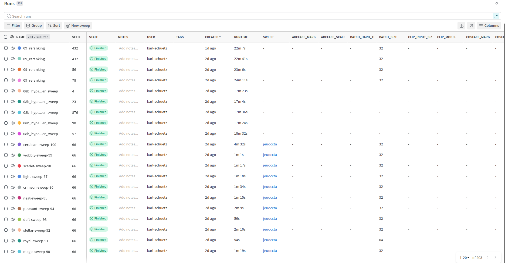
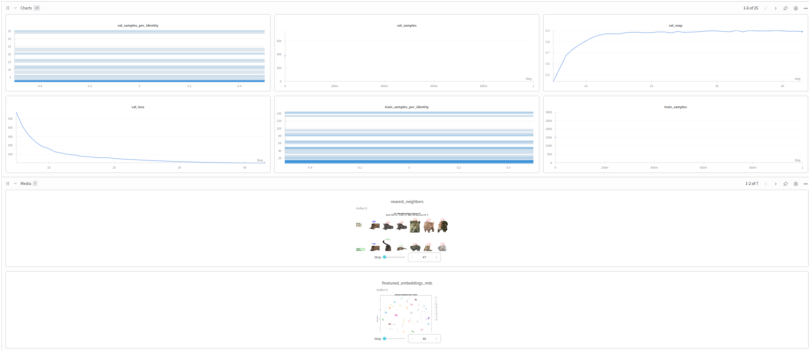

# Kaggle-Competition-Jaguar-Re-identification

This repository contains experiments for the [Jaguar Re-Identification Kaggle Challenge](https://www.kaggle.com/competitions/jaguar-re-id/overview).
The goal of the task is jaguar re-identification (ReID): matching images of the same individual jaguar across different camera trap images.

We started from the provided [Kaggle baseline notebook](notebooks/jaguar-re-identification-challenge-baseline.ipynb) and explored several modifications to improve the identity-balanced mean Average Precision (mAP) metric.


## Procedure

Each experiment measures its performance using identity-balanced mAP on the validation set. All runs are seeded and logged using Weights & Biases to ensure reproducibility.

Individual runs can be viewed in [Wandb](https://wandb.ai/karl-schuetz-hasso-plattner-institut/jaguar-reid-karl-matti-schuetz).

Most experiments were executed with multiple seeds to ensure robustness.

Early in the project we made two structural changes to the baseline notebook:

1. Separation of ArcFace and embedding model

    The ArcFace layer was separated from the embedding projection model.
    This provides a clearer separation between the model architecture and the loss function and makes it easier to experiment with alternative metric-learning losses.

2. mAP-based checkpointing

    The training loop was modified so that model checkpoints are selected based on validation identity-balanced mAP, rather than validation loss.
    A checkpoint is saved only if the validation mAP improves.

The full training implementation can be found in [Training Functions](src/training/training.py).

Each experiment is detailed within the corresponding notebook. Summaries about the exploratory data analysis experiments and leaderboard experiments, can be found in the [Exploratory Data Analysis File](EDA_EXPERIMENTS.md) and [Leaderboard File](LEADERBOARD_EXPERIMENTS.md). 

**Note:** These files only summarize how the components of the final model were chosen. For detailed interpretations and insights, please refer to the original experiment notebooks.


## Final Model

The final model configuration uses:
- Backbone: DINOv3
- Embedding projection with
    - input dimension: 256
    - hidden dimension: 768
    - output dimension: 512
- Loss: mixture of Center Loss and Proxy Anchor Loss 
- Optimizer: AdamW
- Scheduler: OneCycleLR
- Training strategy: Augment samples to balance classes

The exact hyperparameters are documented in the experiment notebooks. The model was trained on the training set, with random augmentations applied to underrepresented identities until each identity had at least 50 images. Backgrounds of images were blurred using a Gaussian kernel. The final cosine distances were reranked using k-reciprocal reranking.

The model achieved a best public score of 0.849 and a private score of 0.866.


## Dataset

The dataset can be downloaded from [Kaggle](https://www.kaggle.com/competitions/jaguar-re-id/data).

After downloading, place the dataset inside the `data/` directory.

## Project Structure

```
├── checkpoints/             # Saved model checkpoints
├── data/                    # Dataset from Kaggle
├── notebooks/               # Jupyter notebooks for experiments and analysis
├── output/                  # Notebook outputs (e.g. submission CSV files)
├── src/                     # Shared source code
|   ├── criterions/          # Loss functions implemented as torch modules
|   ├── datasets/            # Dataset definitions
│   ├── models/              # Model architectures
│   ├── training/            # Training pipeline
│   ├── util/                # Utility functions (e.g. seeding)
|   └── visualization/       # Visualization utilities
├── .env                     # Local environment configuration
├── .env.sample              # Example environment file
├── .python-version          # Fixed python version
├── EDA_EXPERIMENTS.md       # Summary for Exploratory Data Analysis Experiments
├── LEADERBOARD_EXPERIMENTS.md       # Summary for Leaderboard Experiments
├── pyproject.toml           # UV project definition
├── README.md                # Project documentation
├── sweep.yaml               # W&B sweep configuration
└── uv.lock                  # Locked dependencies
```

## Environment Setup

The project uses `uv` for dependency management.
1. Create environment
```
uv sync
```
2. Environment variables
Copy the sample file:
```
cp .env.sample .env
```
Then populate the required values for your environment. Finally, select the created `venv` as the kernel for the notebooks.

## Wandb Screenshot
Training runs are logged using Weights & Biases for experiment tracking, including:
- training metrics
- validation mAP
- checkpoints
- hyperparameters

Example dashboard:

